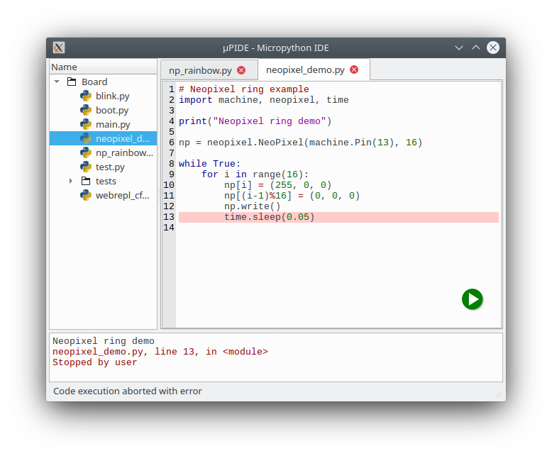
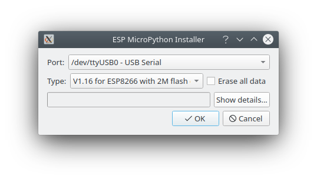

# µPIDE - Micropython IDE

µPIDE is a Micropython IDE in the spirit of the Arduino IDE or
uPyCraft. It's targetting absolute beginners.

It's meant to make working with Micropython as easy as possible. All
the work is done on the target device and python files can be created,
edited, run etc from with the µPIDE. No further tools are needed.

## Status

µPIDE is under active development. The planned features are all
implemented. µPIDE has been tested with the ESP32, ESP8266, PyBoard
V1.1, Lego Spike and the ftDuino32.

A single-exe binary for windows and also for Linux can be found in the
[releases](https://github.com/harbaum/upide/releases/latest).

The µPIDE includes a flasher for the ESP32 and ESP8266
boards. Tegether with the included firmware images getting started
doesn't require any other software.

